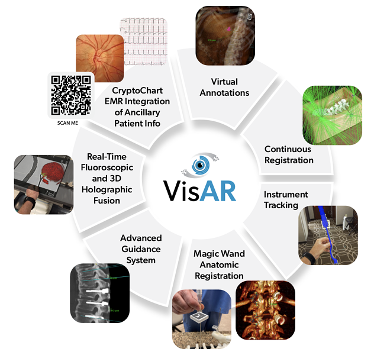
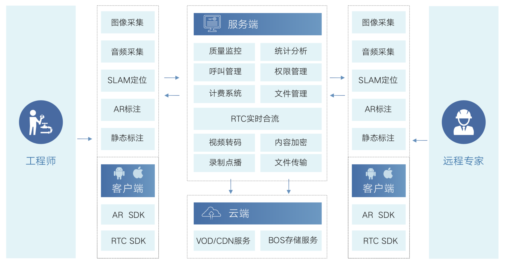
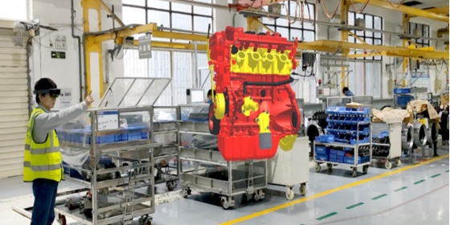
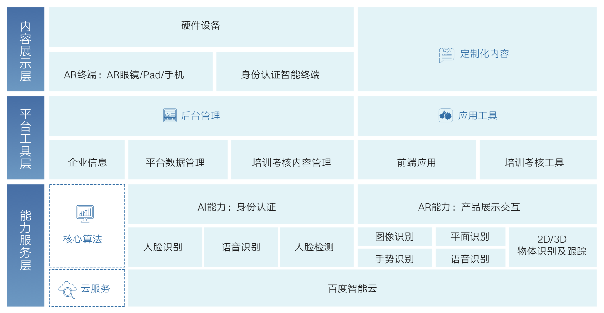
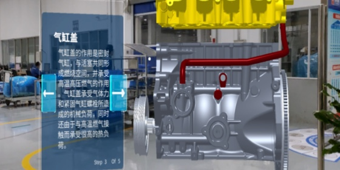

# AR App

---

## 形态

* AR Glass

* AR on Phone

## 应用领域

* 教育与技能培训
	- 学科教学
	- 工业培训

* 游戏娱乐
	- Pokeman Go

* 文化旅游

* 医疗
	- VisAR

  

* 军事

* 建筑
	- BIM: [利用 AR 实现 BIM 数据的现场可视化 | VisualLive](https://unity.com/cn/products/visuallive)

* 智能家居
	- [当AR遇上宜家，从此告别说明书](https://space10.com/%E5%BD%93ar%E9%81%87%E4%B8%8A%E5%AE%9C%E5%AE%B6/)

* 工业

  - [百度工业AR](https://cloud.baidu.com/solution/manufacture/ar-industry.html)
    - 远程协助
    - 培训考核

  

  

  

  

  - [VisionLib](https://visionlib.com/)
