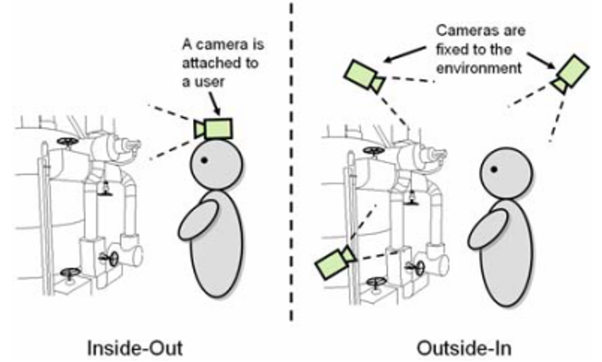
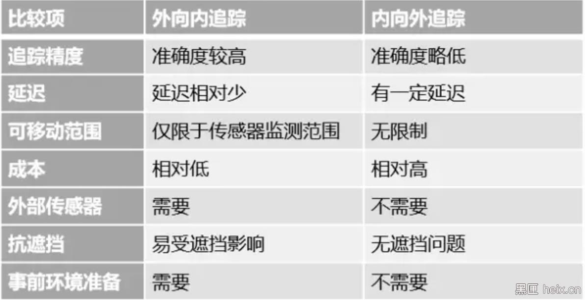
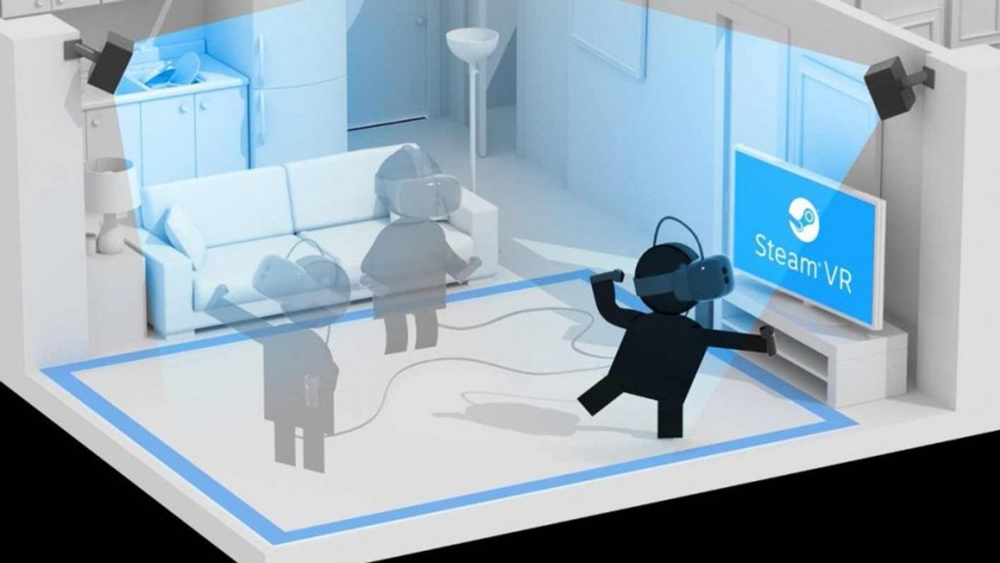
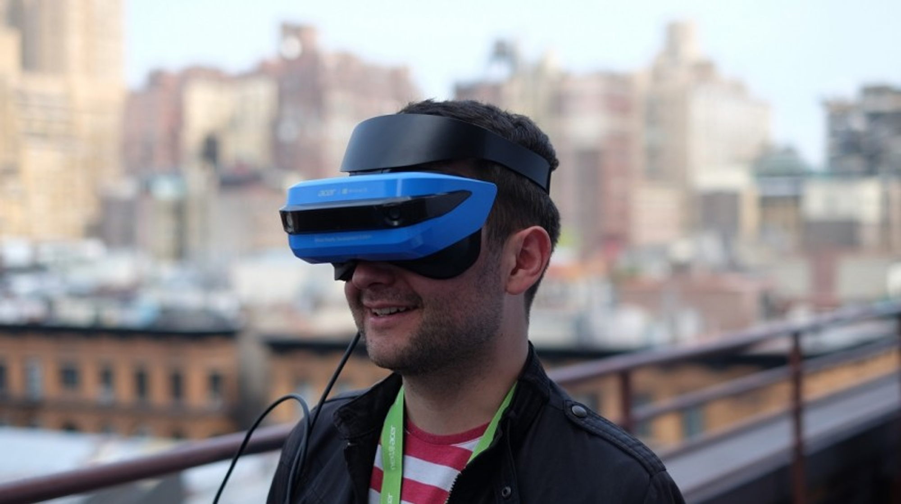

# Tracking

---

## Overview

- [Inside-out v Outside-in: How VR tracking works, and how it's going to change](https://www.wareable.com/vr/inside-out-vs-outside-in-vr-tracking-343)

- [Inside-out tracking](https://xinreality.com/wiki/Inside-out_tracking)

### Outside-in vs Inside-out

  

  

## Outside-in

  

目前位置追踪的解决方案里，外向内追踪技术有较高的准确度，且因为传输资料量少，运算的延迟也低，降低部分因延迟产生的不适感。但是外接设备的限制也很明显，例如：追踪物体远离传感器的测距或是被物体遮挡时，就无法获得位置讯息；操作者不能随意离开传感器的有效监测区，也就限制了其自由活动范围。

江湖上VR的几大门派，皆是使用外向内追踪技术。门派一，激光定位技术，通过定位器进行每秒若干次的激光与光敏传感器进行位置追踪；门派二，采用红外光光学定位，通过一个类似直立麦克风的感测器进行追踪；门派三，通过体感摄像头配合五彩斑斓的神奇魔法棒做可见光光学定位。

精度高、延迟低的外向内追踪技术是目前主流，但它仍然不是人们追求的完美形态，外部环境准备与其可移动范围限制一直与人诟病，就在这时候，HoloLens带着不依赖任何外部传感器的“内向外追踪技术”（Inside-out Tracking）现身江湖，透过环境感知摄像头、深度摄像头以及惯性测单元等部件，实现位置追踪。

## Inside-out

  

内向外追踪技术不需任何外接传感器，因此可以在无硬件搭建、无标记的环境中使用，不受遮挡问题影响，也不受传感器监测范围限制，因此拥有更多样的移动性与更高的自由度。也因为不依靠外接设备进行运算，对于头戴设备的要求更高，精度等相比外向内追踪技术也就不会那么高。
