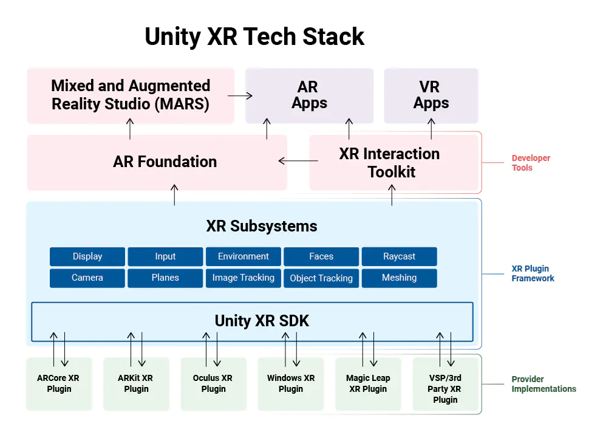
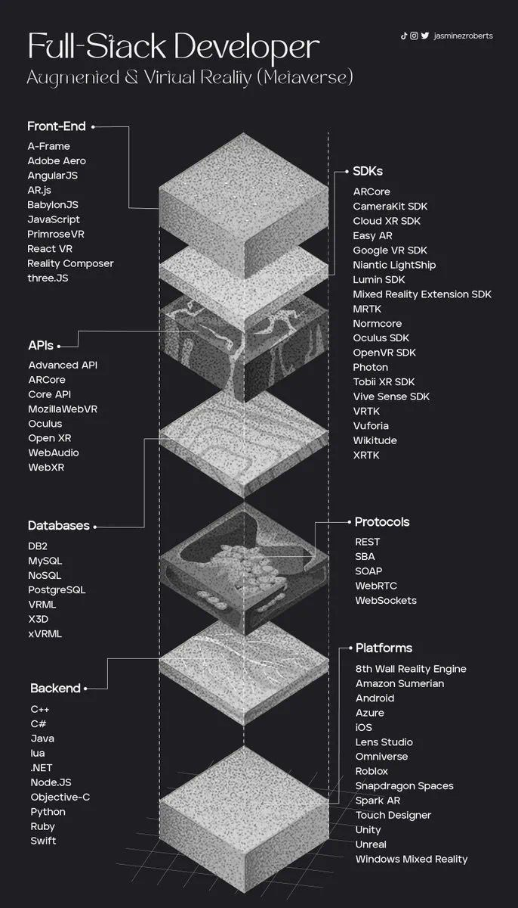

# XR Lab

* XR Blog (CGABC): https://cgabc.xyz/categories/XR/

---

## Overview

* VR

* AR

* MR

### Tech Stack

  

### Full-stack Developer

  

## AR

### 硬件系统

*	基于高清摄像机的舞台AR系统

*	基于普通智能手机的AR系统

*	基于包含深度摄像模块的手持设备AR系统: Google Project Tango

*	基于单目智能眼睛的AR系统: Google Glass

*	基于双目可穿透式智能眼睛的AR系统: Microsoft HoloLens

*	基于投影的AR系统

### 人机交互系统

* 手势识别交互
  - 2D静态手势识别
  - 2D动态手势识别
  - 3D手势识别

* 语音识别交互

* 眼动追踪交互

### 发展趋势

* 软件系统
  - 深度学习
  - 云计算
  - 大范围三维重建

* 硬件系统
  - 光场成像: Magic Leap
  - 半导体光学
	
* 人机交互
  - 新形态用户界面
  - 新形态交互技术

### Knowledge

* 目前高速场景主要集中在 VR、AR 领域，为了避免眩晕感，VR、AR 设备的总体延迟不能超过 20 毫秒，为此，留给位置追踪设备的延迟是不能超过 12 毫秒的。

* 在高速度高精度的姿态追踪方面，vSLAM应用于VR/AR一般至少需要90fps的刷新率才有可能解决眩晕和渲染效果

### News

* 2014年，在Facebook收购Oculus VR后，谷歌又为AR公司Magic leap公司投资了5.42亿美元

* 2015年1月，微软的全息眼镜HoloLens公布于世

* 2019年5月份的Build 2019大会前夕，微软曾在对未来MR市场的预测上提出“2025年的高端MR视场角将达到120°”

* 在 VR 领域，谷歌的 Daydream VR 一体机和 HTC 的 Vive Focus 都内置了双目视觉模组

* 联想于2019年5月14日在美国举行的Transform 3.0 @Accelerate大会上推出了一款AR眼镜：ThinkReality A6。这款产品便是基于诠视科技提供的定制化视觉交互解决方案。

